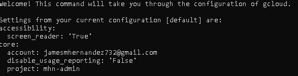

# Honeypot Assignment

**Time spent:** **X** hours spent in total

**Objective:** Create a honeynet using MHN-Admin. Present your findings as if you were requested to give a brief report of the current state of Internet security. Assume that your audience is a current employer who is questioning why the company should allocate anymore resources to the IT security team.

### MHN-Admin Deployment (Required)

**Summary:** How did you deploy it? Did you use GCP, AWS, Azure, Vagrant, VirtualBox, etc.?

I used GCP to deploy it.

### Dionaea Honeypot Deployment (Required)

**Summary:** Briefly in your own words, what does dionaea do?

The dionaea established the server of the honeypot and implemented the configurations.

### Database Backup (Required) 

**Summary:** What is the RDBMS that MHN-Admin uses? What information does the exported JSON file record?

Regarding the exported JSON file, MHN-Admin provides the functionality to export data related to honeypot events and activities in JSON format. The exported JSON file typically includes information such as:

Sensor Data: Details about the honeypots deployed, including their sensor ID, IP address, location, and other relevant information.

Attack Data: Recorded information about the attacks detected by the honeypots. This may include the source IP address, attack type, timestamp, payload details, and other relevant data.

Session Data: Information about the sessions established with the honeypots, such as the source and destination IP addresses, protocols used, timestamps, and session-specific details.

Malware Samples: If configured, the exported JSON file may include information about any malware samples collected by the honeypots, such as file names, hashes, and associated metadata.

**Summary:** How did you find it? Which honeypot captured it? What does each malware do?

MD5 Hash: *Run `md5sum` on the file and record the hash here.*

SHA1 Hash: *Run `sha1sum` on the file and record the hash here.*

## Notes

Describe any challenges encountered while doing the assignment.
